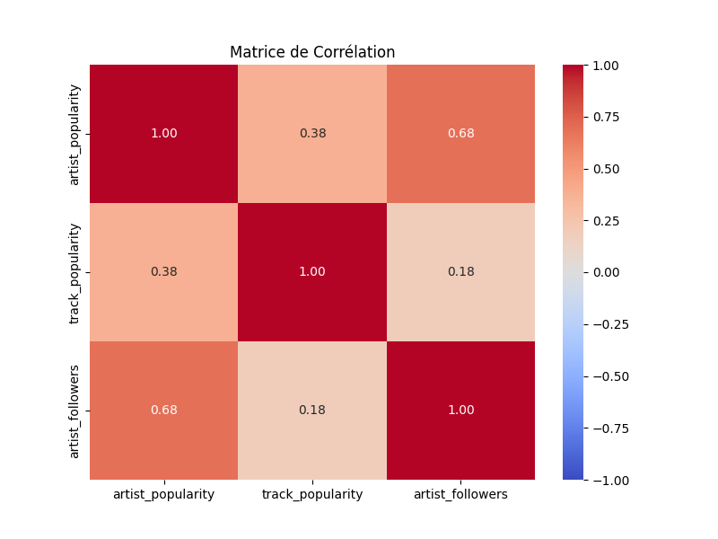
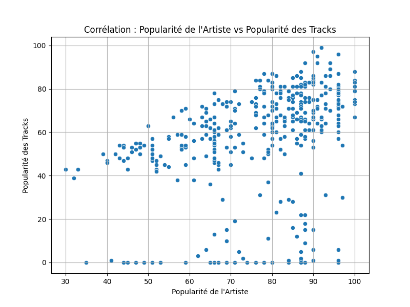
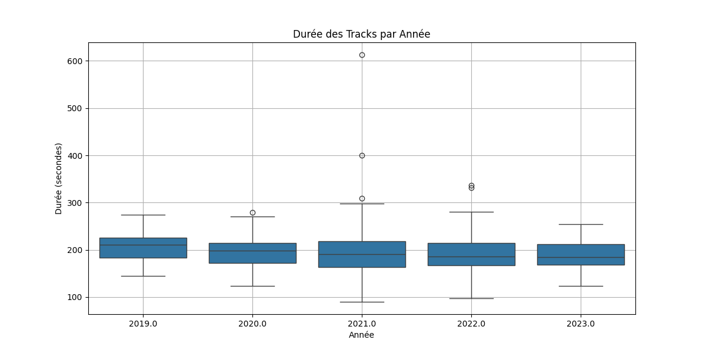

# Rapport : Spotify API Project

---

## **Question 2a : La popularité d’un artiste est-elle corrélée à son nombre de followers ? Ou à la popularité de ses tracks ?**

Pour répondre à cette question, nous avons réalisé les visualisations suivantes :  

1. **Matrice de corrélation (`correlation_heatmap.png`)**  
   La matrice de corrélation permet de quantifier la relation entre les variables qui nous intéressent ici : popularité de l'artiste, popularité des tracks et nombre de followers en affichant des coefficients de corrélation. Cela est utile pour repérer rapidement les relations fortes ou faibles entre les variables.  

   

artist_popularity vs track_popularity (0.38) :
- Corrélation modérée.
artist_popularity vs artist_followers (0.68) :
- Corrélation forte. Les artistes avec plus de followers tendent à être plus populaires bien que ce ne soit pas absolu.

2. **Nuage de points : Popularité vs Nombre de Followers (`correlation_artist_followers.png`)**  
   Ce graphique illustre la relation directe entre la popularité de l’artiste et son nombre de followers. Le nuage de points permet de mettre en évidence la densité et les tendances dans les données.  

   

   Cela vient confirmer notre première interprétation, les artistes ayant plus de followers tendent à être plus populaires. Cependant, au-delà d’un certain seuil (50M+ followers), la popularité ne varie que très peu.

3. **Nuage de points : Popularité de l'artiste vs Popularité des tracks (`artist_vs_track_popularity.png`)**  
   Ce graphique explore la corrélation entre la popularité d’un artiste et celle de ses tracks. 

   
   
   La popularité de l’artiste influence celle de ses tracks, mais beaucoup d'exceptions existent (tracks populaires d’artistes peu connus).

Finalement la popularité d’un artiste est fortement corrélée à son nombre de followers mais modérément liée à la popularité de ses tracks. On imagine facilement que des facteurs externes (viralité, collaborations ...) influencent les tracks populaires. 
---

## **Question 2b : Y a-t-il une évolution des genres les plus écoutés entre 2019 et 2023 ?**

Pour analyser cette question, nous avons utilisé un **graphe en lignes (`sns.lineplot`)** pour observer les tendances des genres musicaux les plus écoutés sur la période 2019-2023.  

- **Type de visualisation :**  
    - Nous avons extrait les 10 genres les plus écoutés et observé leur évolution annuelle.

   

Genres dominants :
- Le genre "pop" est constant et largement populaire sur toute la période.
- Le genre "Unknown" connaît une forte montée (surtout après 2021) ce qui peut représenter des données manquantes ou des artistes moins catégorisés.
Déclin de certains genres :
- Des genres comme "art pop" ou "canadian pop" montrent une diminution après 2021

Finalement, le genre "pop" reste dominant tandis que de nouveaux genres commencent à se démarquer à partir de 2021, suggérant un intérêt croissant pour des styles plus variés.
---

## **Question 3 : Proposer des visualisations supplémentaires pouvant être intéressantes**

Nous avons exploré la distribution des durées des tracks par année en utilisant des **boxplot (`sns.boxplot`)**.

- **Type de visualisation :**
  - Le boxplot permet de visualiser la répartition des durées, les médianes et les valeurs aberrantes pour chaque année.
   

La durée médiane des tracks diminue légèrement après 2020, passant d'environ 200 secondes à un peu moins en 2022 et 2023, suggérant une tendance à des chansons plus courtes ces dernières années.
La variabilité des durées (représentée par la largeur des boxplots) reste relativement constante indiquant peu de changements dans la gamme des durées standards.